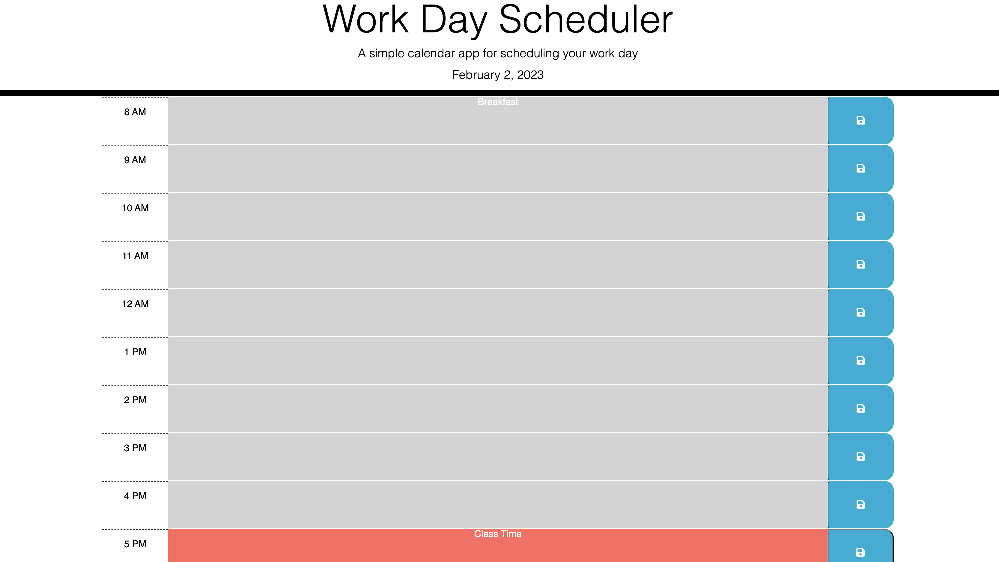

# Work-Day-Scheduler-
## Description
#
This site functions as a daily planner for the user.

## Installation 
#
The web page was installed through pushing local html, css, javaScript, bootstrap, and jquery into github.

## Usage
#
The past, present, and future hours are all color coded. After the user inputs a task, they can click the blue save button so that tasks stays in place - even if the screen is refreshed. The task only changes when the user chooses to do so.  
## Credits
#
Credit goes to the staff for providing us with this complex challenge that helped us dive a little deeper into bootstrap and jquery.

## License
#
N/A
## Deployment Link 
#
(https://bignate38.github.io/Web-API-Code-Quiz/)
